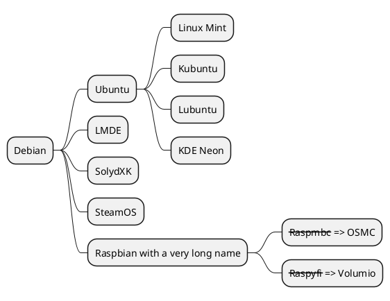

# Examples

Set `plantuml:{filename}` as a fence information. `filename` is used as the file name of generated diagrams. In the following case, `md-sample-sequence.svg` is created.
`filename` is required.


`@startuml` can be omitted. This action complements `@startuml` and `@enduml`.

```plantuml:md-sample-class
Class01 <|-- Class02
Class03 *-- Class04
Class05 o-- Class06
Class07 .. Class08
Class09 -- Class10
```


You can also use diagrams other than uml. See https://plantuml.com/ to confirm what kind of diagrams you can use.




Note that this action generates svg data. you can specify only svg supported diagrams. For instance, `ditaa` is not supported.


You can include diagram type in a fence information with format `plantuml@{type}:{filename}`.
In this case, this action complements `@startgantt` and `@endgantt`.

```plantuml@gantt:md-sample-gantt
[Prototype design] lasts 15 days
[Test prototype] lasts 10 days
```


